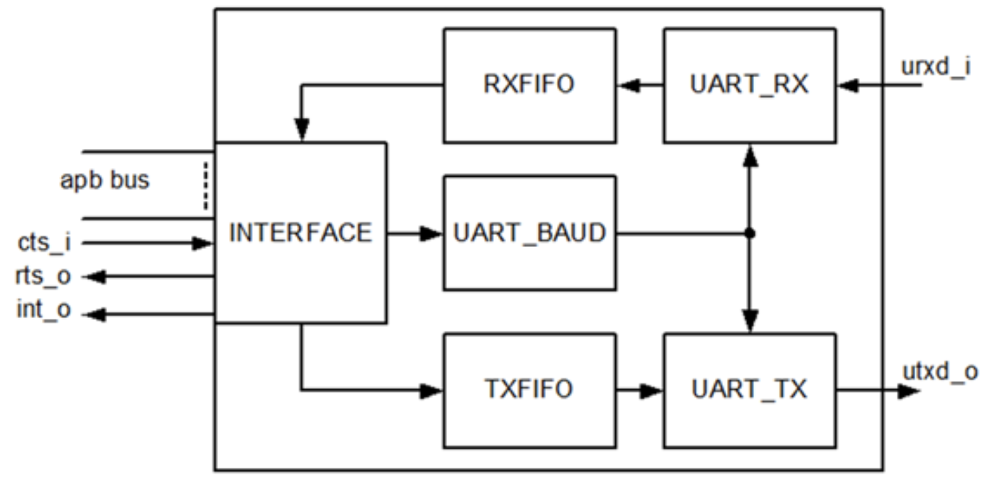
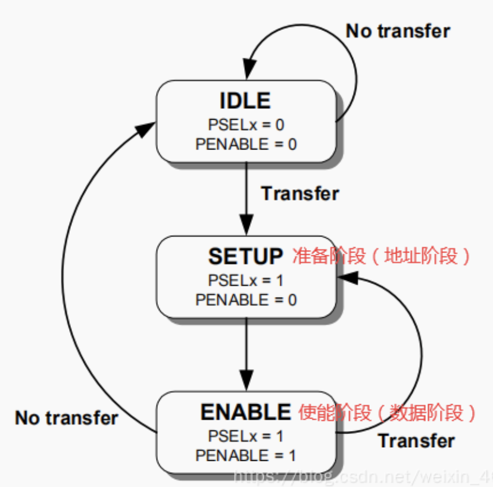
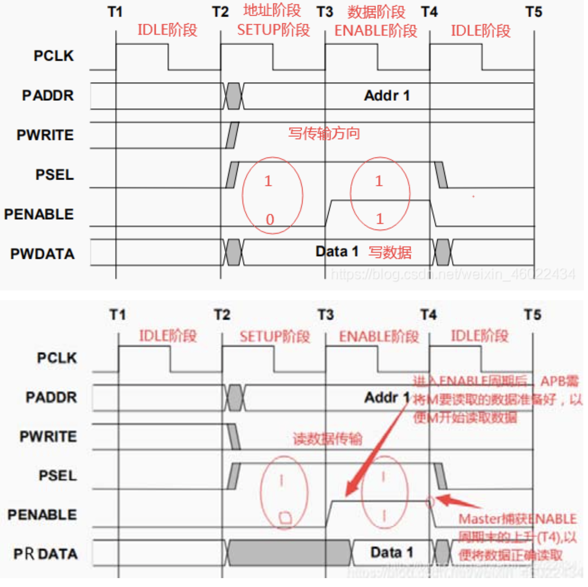

# SV 课程 project 

搭建一个相对完整的 UVM 平台验证 DUT 功能的正确性

---

## DUT 简介

带有 APB 总线的 UART 模块作为 DUT，系统结构图如下所示：

### APB 总线时序

总线协议规定了 2 个周期发送一组数据，状态机如下图所示：

当一笔数据需要传送时：
- APB master 会在 SETUP 状态拉高 Psel 信号（选中对应的 slave 设备）
- 下一个周期进入 ENABLE 状态拉高 PENABLE 信号进行数据传输
- 之后如果有数据需要继续传送则进入 SETUP 状态并拉低 PENABLE，否则进入 IDLE

APB 读写时序如下图所示：

### UART 模块

通用异步收发传输器（Universal Asynchronous Receiver/Transmitter），通常称作 UART

该接口可以实现双向通信，即全双工传输和接收

---

## UVM 验证平台简介
---

## 运行方式
---