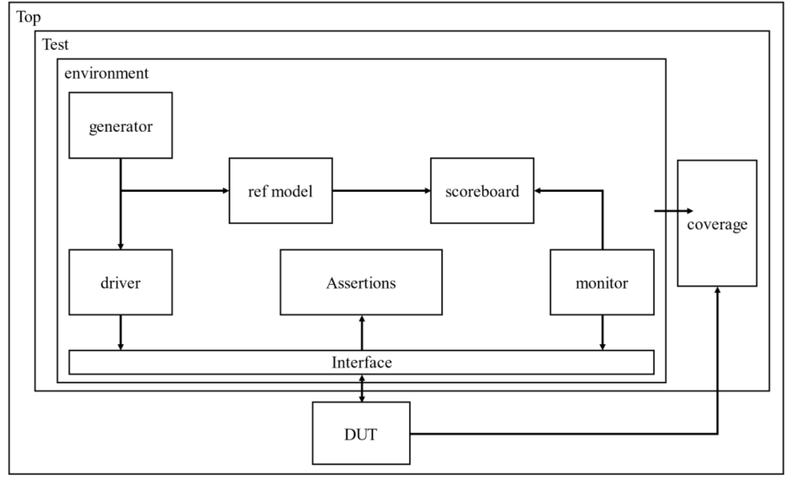

# SV 课程 project 

搭建一个相对完整的 UVM 平台验证 DUT 功能的正确性

---

## DUT 简介

带有 APB 总线的 UART 模块作为 DUT，系统结构图如下所示：


### APB 总线时序

总线协议规定了 2 个周期发送一组数据，状态机如下图所示：


当一笔数据需要传送时：
- APB master 会在 SETUP 状态拉高 Psel 信号（选中对应的 slave 设备）
  
- 下一个周期进入 ENABLE 状态拉高 PENABLE 信号进行数据传输

- 之后如果有数据需要继续传送则进入 SETUP 状态并拉低 PENABLE，否则进入 IDLE

APB 读写时序如下图所示：


### UART 模块

通用异步收发传输器（Universal Asynchronous Receiver/Transmitter），通常称作 UART

该接口可以实现双向通信，即全双工传输和接收

该模块特性如下：
- 系统最大工作频率满足 100MHz，功能时钟 26MHz（参考时钟）

- 寄存器配置接口满足 AMBA2.0-APB 总线时序接口，总线位宽 32bit

- 数据传输符合串口时序，奇偶校验功能可配置
  
- 波特率可任意配置，配置范围为 2400-115200bps
  
- 具有数据收发中断功能，可配置中断触发深度

- UART 数据发送帧间隔可配置

- 具有状态指示功能

寄存器说明说下：

|名称|偏移地址|属性|备注
|--|--|--|--
|发送数据|0x00|可读可写|bit[7:0]
|数据接收|0x04|只读|bit[7:0]
|波特率|0x08|可读可写|bit[9:0]为波特率分频系数，范围13-676
|功能模式|0x0C|可读可写|bit[0]决定是否有校验位，bit[1]决定奇偶校验模式（1-奇校验，0-偶校验），bit[2]决定是否有停止位（只对 TX 有效），bit[3]决定是否校验停止位（只对 RX 有效），bit[14]决定 TX FIFO 复位，bit[15]决定 RX FIFO 复位
|rx fifo 触发深度|0x10|可读可写|bit[3:0]设置触发深度，可选范围 1-8
|tx fifo 触发深度|0x14|可读可写|bit[3:0]设置触发深度，可选范围 0-8
|发送帧间隔|0x18|可读可写|bit[3:0]设置帧间隔 0-8（只对 TX 生效）
|状态寄存器|0x1C|可读可写|读取该寄存器时，bit[0]表示 TX FIFO 触发中断，bit[1]表示 RX FIFO 触发中断，bit[2]表示 RX 接收数据时奇偶校验错误，bit[3]表示 RX 接收时停止位校验错误。向该寄存器写 1 表示清除中断
|rx fifo 状态|0x20|只读|bit[5:0]表示当前 RX FIFO 数据量
|tx fifo 状态|0x24|只读|bit[5:0]表示当前 TX FIFO 数据量

---
## UVM 验证平台简介

测试平台结构如下图所示：



整个软件验证环境，需要经历：
- 建立阶段（build），在建立阶段将所有模块例化

- 连接阶段（connect），在连接阶段中将各模块相连

- 产生激励阶段（generate），在产生激励阶段中产生针对 DUT 的激励

- 发送激励阶段（transfer），在发送激励阶段一边发送产生的激励，一边进行数据比对，产生报告

文件结构以及说明（`./testbench` 中的代码）：

```
./testbench
|
├── _component               // UVM 组件
|   |                            
|   ├── apb_input_driver.sv      // 输入 driver                           
|   ├── apb_input_monitor.sv     // 输入 monitor      
|   ├── input_agent.sv           // 输入 agent 
|   |
|   ├── uart_output_monitor.sv   // 输出 monitor
|   ├── output_agent.sv          // 输出 agent
|   |
|   ├── sequencer.sv             // 输入激励
|   |
|   ├── scoreboard.sv            // 数据比对
|   |
|   ├── model.sv                 // DUT 行为模型
|   |
|   └── environment.sv           // UVM 环境
|
├── _interface
|   |      
|   └── apb_uart_interface.sv    // DUT 驱动接口、assertion
|
├── _object               // object 对象（传输数据对象）
|   |
|   ├── _sequence
|   |   |
|   |   └── base_sequence.sv
|   |
|   └── transaction.sv
|
├── _test_case            // 测试案例
|   |                           
|   ├── base_test.sv
|   |       
|   ├── test_case0.sv           // 测试案例 0     
|   ├── test_case1.sv           // 测试案例 1 
|   ├── test_case2.sv           // 测试案例 2 
|   ├── test_case3.sv           // 测试案例 3 
|   ├── test_case4.sv           // 测试案例 4 
|   └── test_case5.sv           // 测试案例 5 
|
├── _reg_model            // 寄存器模型 
|   |  
|   ├── reg_model.sv
|   |                            
|   ├── reg_baud.sv
|   ├── reg_conf.sv
|   ├── reg_delay.sv
|   ├── reg_rx.sv
|   ├── reg_rxfifo_stat.sv
|   ├── reg_rxtrig.sv
|   ├── reg_tx.sv
|   ├── reg_txfifo_stat.sv
|   ├── reg_txtrig.sv
|   └── reg_status.sv 
|
├── coverage.sv         // 覆盖率分析
|
├── pkg.svh             
|      
└── testbench_top.sv    // testbench 顶层
```
---
## 运行方式

Windows，QuestaSim

可以直接在 QuestaSim 中执行 `./sim` 中的脚本，进行编译、仿真

---